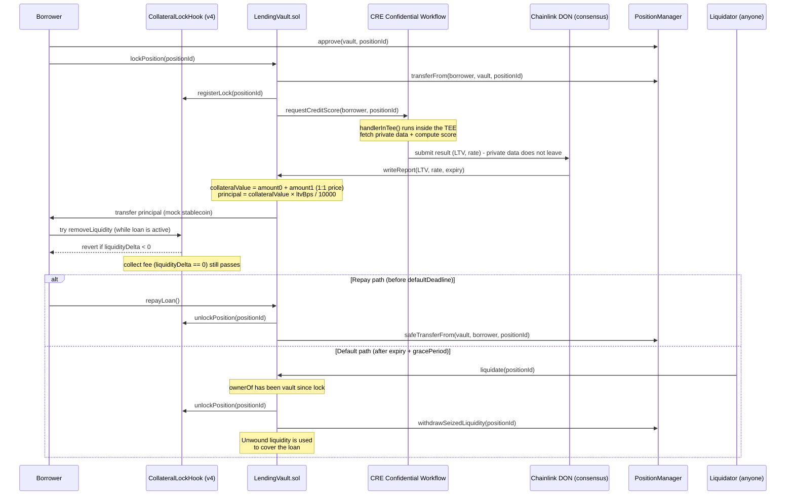

# Veilend
### Confidential Credit Scoring for Uniswap v4 LP Position–Based Loans

> This document is the project plan for ETHGlobal ETHOnline 2026 (4–16 Sept 2026).
> Combined version — Sections 1–13 finalized 6–7 September 2026, Sections 14–16 added 7 September 2026 (CRE integration architecture, configuration decisions, verified Sepolia contract addresses).
> **Update 7 September 2026 (timeline revision):** Section 7 was compressed from 11 days to **6 days** because remaining effective time was tighter than originally estimated, and development will be assisted by an **AI coding agent** to speed up routine code. References to "11 days" elsewhere (Sections 2, 4, 14.1) were updated to match this change.
> **Update 7 September 2026 (architecture review):** two mandatory pre-coding decisions were locked — (11) collateral only from a self-hooked demo pool, (12) collateral valuation formula + loan principal. See Section 12 #11–#12 and Section 14.1.

---

## 1. Project Summary

**One-liner:** A lending protocol where Uniswap v4 LP position owners can get a loan with a better LTV (loan-to-value) if their trading/risk history — computed **confidentially** inside a Chainlink CRE Confidential Workflow (TEE) — shows a low-risk profile, without ever leaking the raw data to the public.

---

## 2. Background & Insight

**Problem:** Uniswap v4 LPs often have capital "locked" in their liquidity positions. If they need liquid funds, they typically have to withdraw liquidity (losing fees/exposure) — even though that LP's risk profile (trading history, how often they rebalance, volatility exposure) could actually be used as a creditworthiness signal, similar to a credit score in TradFi.

**Differentiation from similar existing projects:**
| Similar project (found during research) | Focus | Difference vs LP Credit Line |
|---|---|---|
| *LiquidMind* (CRE + Uniswap v4) | Automated rebalancing & dynamic fee | We build a **credit/lending** product, not automated rebalancing |
| *Chainlink "Automated Portfolio Rebalancing" template* | Portfolio allocation rebalancing | Same confidential pattern, completely different domain |
| *Dark-pool trading RWA via CRE* (Convergence hackathon) | Private trade execution | We do not hide trades; we hide **credit scoring data & logic** |
| *InControl* (CRE + x402) | Monetizing a personal financial agent | Does not touch Uniswap v4 LP positions at all |

Conclusion: the combination of "v4 LP position as collateral" + "private credit score via CRE" was not found in any project at the time of research.

---

## 3. Core Concept / How It Works

Short flow (MVP version, simplified from a full lending protocol):

1. The borrower has an LP position in the **Veilend demo pool** — a Uniswap v4 pool deployed by this project, with `CollateralLockHook` attached to the `PoolKey` at `initialize`. Positions in existing Uniswap v4 pools (without our hook) **are not accepted** as collateral (see Section 12, Decision #11).
2. Before lock, the borrower `approve(vault, positionId)` on `PositionManager` — this approval is a mandatory prerequisite, checked by `LendingVault` (see Section 12, Decision #6).
3. The borrower locks that position as collateral in the `LendingVault` contract — **vault custody**: `lockPosition` uses the approval from step 2 **now** (`transferFrom` NFT to vault). Loan state still records `borrower = msg.sender` (not `ownerOf` after transfer). The hook `registerLock` is still called; decrease enforcement relies on `CollateralLockHook` plus NFT ownership in the vault.
4. `LendingVault` triggers a **CRE Workflow** (via event/HTTP trigger).
5. Inside CRE, a **confidential handler** (`handlerInTee`) that:
   - Fetches private data — a **hybrid** approach: 1 real LP position data point (e.g. size/age of the position, fetched via a view call to `PositionManager`) combined with a simulated risk history for demo purposes.
   - Computes a risk score → determines **maximum LTV** and **interest rate**.
   - Scoring logic & raw data **never leave the enclave** — only the final numbers come out.
6. Results (LTV, rate, expiry) are sent on-chain via a DON-consensus-verified report, written to `LendingVault`. `expiry` here is also the basis for `defaultDeadline` (see step 9).
7. `LendingVault` computes `collateralValue` on-chain (1:1 mock prices) then disburses `principal = collateralValue × ltvBps / 10000` in mock stablecoin to the borrower (see Section 12, Decision #12).
8. While the loan is active, the **v4 hook** (`CollateralLockHook`) prevents the borrower from **decreasing** liquidity from the locked position (`liquidityDelta < 0` is reverted). Collecting fees (`liquidityDelta == 0`) **remains allowed** so collateral stays productive.
9. **Repay path:** When the loan is repaid (`repayLoan()`) before `defaultDeadline` (`expiry + gracePeriod`) → vault pulls the stable → hook unlocks → `safeTransferFrom` returns the NFT to `loan.borrower` → the position can be withdrawn normally again.
10. **Default path:** If the borrower has not repaid after `defaultDeadline` has passed, anyone (including a keeper/bot) can call `liquidate(positionId)` on `LendingVault`. The NFT **is already** in the vault since lock; `liquidate` requires `ownerOf == vault` (no `transferFrom` from the borrower), unlocks the hook, then `withdrawSeizedLiquidity` unwinds liquidity to cover the loan.



---

## 4. Technical Architecture

| Component | Responsibility | Technology |
|---|---|---|
| `CollateralLockHook.sol` | v4 hook owned by the **Veilend demo pool**. In `beforeRemoveLiquidity`, revert if the position is locked **and** `liquidityDelta < 0`. Collect fee (`liquidityDelta == 0`) passes. Continues to block decrease while locked, including if the vault itself has not unlocked | Solidity, Uniswap v4 hooks (`beforeRemoveLiquidity`) |
| `LendingVault.sol` | Custody of the position NFT at `lockPosition`, check approval + check the position comes from the demo pool, receive LTV report from CRE, compute `principal` from `collateralValue`, disburse the loan, return the NFT on `repayLoan`, **execute `liquidate()` (NFT already in vault) + `withdrawSeizedLiquidity()` on default** | Solidity |
| Veilend demo pool | v4 pool `initialize`d with `CollateralLockHook` as the hook in `PoolKey`; the only pool whose positions are valid collateral | Uniswap v4 `PoolManager.initialize` + 2 mock ERC-20s |
| `credit-scoring-workflow` | CRE workflow with a confidential handler to compute score & LTV | TypeScript (`@chainlink/cre-sdk`) |
| Mock token pair + mock stablecoin | Two pool tokens (1:1 price) and the token lent to the borrower | Simple ERC-20 (testnet) |
| Frontend/dashboard (optional) | Visual demo: request loan → see resulting LTV → try withdraw (hit revert) → repay | Next.js / CLI script (may be very simple) |

**Design note — the hook attaches to the pool, not to the NFT (final decision, see Section 12 #11):** A Uniswap v4 hook is part of the `PoolKey` and is only called for pools initialized with that hook. `CollateralLockHook` **cannot** lock positions in existing v4 pools (official Sepolia ETH/USDC, etc.). Therefore MVP collateral is **only** positions minted in the Veilend demo pool. PositionManager `ISubscriber` is **not** a hook substitute: a subscriber is a notifier, the user can `unsubscribe`, and `transferFrom` detaches the subscriber. The limitation “not any v4 LP” must be written in the README, not hidden.

**Design note — vault custody at lock (Decision #2, update 9 September 2026):** `lockPosition` transfers the PositionManager NFT to the vault. `loan.borrower` remains the caller address. The borrower is not the owner → cannot meaningfully `approve(0)`, cannot transfer the NFT, cannot `modifyLiquidities`. The hook still blocks decrease while `locked == true` (including if the vault itself has not unlocked). Collecting fees at the hook level (`liquidityDelta == 0`) remains allowed; the vault does **not** `collectFees` and does **not** re-approve the NFT back to the borrower while the loan is active.

**Design note — default mechanism / NFT already in vault (Decision #6, update 9 September 2026):** Approval at `lockPosition` is permission to **pull now**, not a reserve until default. After `block.timestamp > expiry + gracePeriod` and the loan is unpaid, permissionless `liquidate(positionId)` requires `ownerOf == vault` (error `NftNotInVault` otherwise), unlocks the hook, then `withdrawSeizedLiquidity()` unwinds liquidity. There is no `transferFrom` from the borrower at liquidate. `CollateralLockHook` is unchanged — it still only guards `removeLiquidity` while `locked == true`.

**Confidential handler details (the most important part for the Chainlink prize):**
- Must use `handlerInTee` (TypeScript) — not a regular handler.
- At least 1 of: sensitive input, secret, confidential API response, private parameter, or intermediate value must be processed **inside** the enclave.
- Data source (final decision, see Section 12): **hybrid** — fetch 1 real LP position data point (via a view call to `PositionManager`, e.g. size/age of the position) as a *private input* inside the TEE, combined with a simulated risk history to compute the score. This satisfies the "sensitive input/private parameter processed inside the enclave" requirement without needing an external API/indexer integration that is more likely to slip.

---

## 5. Qualification Requirements (Checklist per Partner)

### ✅ Uniswap Foundation — Best Uniswap Stack Contribution
- [ ] Public, open-source GitHub repository
- [ ] `FEEDBACK.md` file at the repo root
- [ ] Submit the Developer Feedback form: https://developers.uniswap.org/hackathon-feedback (include the `FEEDBACK.md` link)
- [ ] README clearly points to the relevant smart contracts & code lines (especially `CollateralLockHook.sol`)

### ✅ Chainlink — Best Confidential Workflow
- [ ] CRE Workflow uses Confidential Workflows for a **meaningful** part of the application (not a detached example/placeholder)
- [ ] Workflow registers & uses `handlerInTee` (TypeScript)
- [ ] The confidential part processes at least 1 of: sensitive input / secret / confidential API response / private parameter / intermediate value
- [ ] Execution proof: CRE CLI simulation **or** live deployment to the CRE network
- [ ] Evidence included in the submission: demo video, terminal output, or execution logs

---

## 6. Scope: MVP vs Stretch Goals

**MVP (must be finished):**
- Deploy `CollateralLockHook` + **initialize the Veilend demo pool** (2 mock ERC-20s, hook attached to `PoolKey`) + mint ≥1 test position in that pool (decision #11)
- v4 hook that successfully blocks decrease liquidity (`liquidityDelta < 0`) while the position is locked, and **still allows collect fee** at the hook level (NFT custody in the vault during lock)
- CRE workflow with `handlerInTee` that computes a score from hybrid data (1 real LP data point + simulated risk)
- Successful CRE CLI simulation run & captured as evidence (screenshot/log)
- `LendingVault` that can lock (check approval + pull NFT to vault + check demo pool) → receive LTV report → compute `principal` from `collateralValue` (#12) → disburse loan → repay (return NFT) → unlock
- **Minimal default mechanism (NFT already in vault)**: `liquidate(positionId)` requires `ownerOf == vault` once `defaultDeadline` has passed, then `withdrawSeizedLiquidity()` unwinds collateral to cover the loan — demoed end-to-end (see Section 12, Decision #6)
- README + FEEDBACK.md + demo video — README must state: (a) demo pool with hook only, (b) 1:1 prices / no oracle, (c) trusted relayer, (d) NFT is custodied by the vault during lock (not “approval can be revoked after lock”)
- Hook continues to block decrease during lock; collecting fees mid-loan is not implemented in the vault (`collectFees` is out of scope)

**Stretch goals (if time remains):**
- Enter the Automated Liquidation Protection Challenge — **join/skip decision is only made on buffer day (day 6), after MVP is done** (see Section 12)
- Live CRE workflow deployment to the network (not just simulation)
- More polished frontend dashboard
- Dynamic re-scoring (workflow re-runs periodically, not only once at loan origination)
- Auto-liquidator/keeper bot, auction mechanism, or partial liquidation (in MVP, seizure is all-or-nothing and called manually/permissionlessly without an automatic keeper)
- `collectFees()` in the vault while the loan is active

---

## 7. Timeline (± 6 Days) — Revised 7 September 2026

> **Revision note:** The original timeline (11 days) was compressed to **6 days** because remaining effective time was tighter than originally estimated. This compression is considered realistic because development is assisted by an **AI coding agent** to speed up boilerplate/routine code (contract skeletons, test cases, etc.) — human time is focused on design decisions, integration verification, and debugging the riskiest parts (hook, CRE handler, default path). The official event deadline remains 16 September 2026, so 7–16 Sept automatically become unexpected buffer — but do not rely on that buffer; treat **day 6 (12 Sept) as the real submit target**.

| Day | Date | Focus |
|---|---|---|
| 1 | 7 Sept | Repo setup (use the official Uniswap `v4-template` + `HookMiner`, Section 14.1 #10); skeleton `CollateralLockHook.sol` (`beforeRemoveLiquidity`: revert if locked && `liquidityDelta < 0`) & `LendingVault.sol` (state, `lockPosition()` with approval check + demo-pool check); deploy hook; `initialize` Veilend demo pool (2 mock tokens, Decision #11); mint a test LP position in that pool on Sepolia (addresses in Section 15); prefund vault with mock stablecoin (Decision #12). Use the AI coding agent to generate hook & vault boilerplate in parallel. |
| 2 | 8 Sept | Build CRE workflow: implement `handlerInTee` per the algorithm in Section 13.4 (fetch `liquidity` + `mintTimestamp` via `eth_getLogs`, compute `creditScore`, map to LTV/APR tier). Test until CRE CLI simulation succeeds & can be captured as evidence. *(The Liquidation Protection Challenge `join()` window also opens today — no decision required yet, see day-6 checkpoint.)* |
| 3 | 9 Sept | Build relayer script (Section 14.2): subscribe to `PositionLocked` event → trigger CRE CLI simulation → parse result → call `submitCreditReport()` (`onlyRelayer`) on `LendingVault`. End-to-end test of lock → receive report → loan disbursement. |
| 4 | 10 Sept | Implement & test the repay path (`repayLoan()` → unlock) and the default path (`defaultDeadline` passed → `liquidate()` → `withdrawSeizedLiquidity()`) end-to-end. Write unit & integration tests (Foundry) — AI coding agent helps generate basic test cases, human time focuses on edge cases. |
| 5 | 11 Sept | Write `README.md` (with links to code lines) & `FEEDBACK.md`, record demo video (≤5 minutes) covering repay path & default path, collect CRE CLI simulation evidence (logs/screenshots). |
| 6 (buffer & submit) | 12 Sept | Buffer for bug fixes & final polish. Submit Uniswap Developer Feedback Form, submit to ETHGlobal dashboard, pick 2 partner prizes (Uniswap + Chainlink). **Checkpoint:** if MVP is already solid & there is still time before the event deadline (16 Sept), only then consider the Liquidation Protection Challenge stretch goal — if in doubt, skip. |

---

## 8. Risks & Mitigations

| Risk | Impact | Mitigation |
|---|---|---|
| Deploying v4-core yourself on testnet is harder than expected (hook address mining, etc.) | Delay at the start | Use the official Uniswap v4 hook starter template (Foundry template) from day 1, do not build from scratch |
| Live Chainlink Confidential Compute access is limited/beta | Cannot deploy live | Fine — official CLI simulation is accepted as qualification evidence |
| "Credit score" data looks too made-up/mock | Judges doubt realism | State explicitly in README & demo that data is simulated for demo purposes, but the confidential architecture is real and can be wired to real data |
| Time runs out before writing a good FEEDBACK.md | Lose a mandatory Uniswap requirement | Allocate **Day 5 (11 Sept)** specifically for documentation; do not postpone it to the last day |
| Misconception that “the hook locks all existing v4 LPs” | Day-1 integration fails / Uniswap judges think we don't understand v4 | Collateral only from the self-hooked demo pool (Decision #11); do not use `ISubscriber` as a substitute for enforcement |
| Position-exit paths outside `modifyLiquidity` on the demo pool are not visible to the hook | Residual risk even though the NFT is already in the vault | NFT is custodied by the vault at lock (Decision #2); hook still blocks decrease. Do not claim the hook closes every unwind path |
| LTV without collateral valuation → loan amount is undefined | Vault cannot disburse a number that can be explained to judges | Use Decision #12 formula (`collateralValue = amount0 + amount1` at 1:1 price; `principal = collateralValue × ltvBps / 10000`); no oracle in MVP |
| Borrower does not `approve()` at lock | `lockPosition` cannot pull the NFT | Approval is checked as a mandatory requirement in `lockPosition()` (revert `ApprovalRequired`). After pull, revoke/transfer from the borrower does not move the NFT and does not break `liquidate` |
| Solo work → no parallelization, one blocker can delay the entire subsequent sequence; timeline is now denser (6 days) so delay tolerance is smaller | Cascading delay in the timeline | Follow the day sequence in Section 7 strictly, use official starter templates, and use the AI coding agent to speed up routine code so human time can focus on the riskiest parts (hook, CRE handler, default path) |

---

## 9. Tech Stack

- **Smart contracts:** Solidity, Foundry, Uniswap v4-core & v4-periphery
- **Chain:** Ethereum Sepolia testnet
- **Confidential workflow:** Chainlink CRE, `@chainlink/cre-sdk` (TypeScript), CRE CLI
- **Tokens:** 2 mock ERC-20s as the demo pool pair (1:1 price) + 1 mock ERC-20 stablecoin for loans
- **(Optional) Frontend:** Next.js / ethers.js / viem — default MVP is a CLI script / `cast`

---

## 10. Resources & Reference Links

- Uniswap v4 deployments: https://docs.uniswap.org/contracts/v4/deployments — **Sepolia addresses already verified, see Section 15**
- Uniswap Developer Docs: https://developers.uniswap.org/docs
- Uniswap Hackathon Feedback Form: https://developers.uniswap.org/hackathon-feedback
- Chainlink CRE Docs: https://docs.chain.link/cre
- Hello Confidential Workflow (starter): https://docs.chain.link/cre-templates/hello-confidential-workflows
- Confidential Workflows Starter Templates (GitHub): https://github.com/smartcontractkit/cre-templates/tree/main/starter-templates/confidential-workflows
- Automated Liquidation Protection Template: https://docs.chain.link/cre-templates/automated-liquidation-protection
- Confidential Workflows Bootcamp (video): https://www.youtube.com/watch?v=ArHoB1JDSlE
- Liquidation Challenge repo (stretch goal): https://github.com/solangegueiros/cf-liquidation-protection-challenge

> ⚠️ Important note from Chainlink: use **CRE**, not Chainlink Functions or Automation — both are being deprecated.

---

## 11. Final Deliverables Checklist (before submit)

- [ ] Public GitHub repo with a clear commit history (not 1 large commit at the end)
- [ ] `README.md` — project description, architecture, links to contract code lines & CRE workflow
- [ ] `FEEDBACK.md` — experience using Uniswap documentation/tooling
- [ ] Demo video ≤5 minutes showing: request loan → LTV result from CRE → hook blocks withdrawal → repay → unlock
- [ ] Demo (same video or separate) showing the default path: `defaultDeadline` passed → `liquidate()` successfully seizes the position → `withdrawSeizedLiquidity()` unwinds collateral
- [ ] CRE CLI simulation evidence (logs/screenshots/terminal output) included in the repo
- [ ] Submit Uniswap Developer Feedback Form
- [ ] Submit project to ETHGlobal dashboard, pick partner prizes: **Uniswap Foundation** + **Chainlink**

---

## 12. Decisions Already Made (finalized 6 September 2026, default-mechanism update 6 September 2026, hook-architecture & valuation update 7 September 2026)

Decisions #1–#6 (product) plus #11–#12 (architecture, locked 7 Sept). Configuration decisions #7–#10 are in Section 14.1. Summary:

| # | Decision | Final Choice | Short Rationale | Status |
|---|---|---|---|---|
| 1 | "Credit score" data source | **Hybrid** — 1 real LP position data point (via `PositionManager`) + remaining simulated risk history, processed inside `handlerInTee` | Middle ground: still a real-data element for credibility, without adding external API/indexer integration complexity | ✅ Final, already synced to Sections 3 & 4 |
| 2 | LP position ownership while locked | **Vault custody** (update 9 Sept 2026): `lockPosition` `transferFrom`s the NFT to the vault. `loan.borrower` remains the caller. Hook still blocks decrease | Closes the revoke/transfer-NFT gap after the loan is disbursed; ERC-721 approval is not a lock | ✅ Final (revised 9 Sept 2026), already synced to Sections 3, 4 & 8 |
| 3 | Real liquidation engine | **Revised** — a minimal version (`liquidate` + `withdrawSeizedLiquidity`) is built in MVP; remaining future work is only auto-liquidator/keeper bot, auction, and partial liquidation | The default scenario was initially not covered in MVP; after re-evaluation, a minimal mechanism is still needed so the lending protocol has a complete default-resolution path, without a large scope increase (see Decision #6) | 🔄 Revised, already synced to Sections 3, 4, 6, 7, 8 & 11 |
| 4 | Enter Automated Liquidation Protection Challenge stretch goal ($500) | **Deferred** — re-evaluate on day 6 (buffer), after MVP is done | This is extra scope with a hard join deadline (starts 8 Sept) and cannot be updated after the submission deadline; realistically it can only be assessed if MVP is already safe. Timeline is now 6 days (not 11), so margin for this stretch goal is even thinner — realistically it will most likely be skipped | ⏳ Checkpoint in Section 7 (day 6) |
| 5 | Team size & work split | **Solo** — no parallel work split | The timeline in Section 7 is executed sequentially as-is, with no per-person breakdown needed | ✅ Final |
| 6 | Borrower default / failed-repayment mechanism | **NFT already in vault** (update 9 Sept 2026): approval is only a pull prerequisite at `lockPosition`. Permissionless `liquidate(positionId)` after `defaultDeadline` requires `ownerOf == vault` (no `transferFrom` from borrower), unlocks the hook, then `withdrawSeizedLiquidity()` | `approve(0)` / `setApprovalForAll(false)` / transfer after lock made liquidate fail under a reserve-approval model. Custody at lock closes that without a new NFT wrapper | ✅ Final (revised 9 Sept 2026), already synced to Sections 3, 4, 6, 7, 8 & 11 |
| 11 | Pool scope / which pool the hook applies to | **Veilend demo pool only.** Deploy `CollateralLockHook`, then `initialize` our own pool with that hook in `PoolKey`. `lockPosition()` reverts if the position does not belong to the demo pool. Positions in existing v4 pools **are rejected**. Collect fee (`liquidityDelta == 0`) is allowed; decrease (`liquidityDelta < 0`) is reverted while locked | A v4 hook attaches to the pool at initialize, not to a global NFT/PositionManager. Without our own pool, `beforeRemoveLiquidity` is never called for the borrower's position. `ISubscriber` is not enforcement | ✅ Final 7 Sept 2026, already synced to Sections 3, 4, 6, 7 & 8 |
| 12 | Collateral valuation & loan principal | **No oracle.** Pool pair = 2 mock ERC-20s at **1:1** price. `collateralValue = amount0 + amount1`. `principal = collateralValue × ltvBps / 10000`. Vault is prefunded with mock stablecoin at deploy. CRE only returns credit terms `(ltvBps, aprBps, expiry)`; the `principal` number is computed on-chain in the vault | LTV without a position value cannot disburse a loan. Price feeds are out of 6-day scope. This split is also clear for judges: the TEE decides *what percent*, the vault decides *how much* | ✅ Final 7 Sept 2026, already synced to Sections 3, 4, 6, 7, 8 & 14 |

**What still needs monitoring as development proceeds:**
- On day 6/buffer (see Section 7), check whether joining the Liquidation Protection Challenge is realistic given remaining time & MVP stability. If joining, remember the join window starts 8 September and **no workflow updates are allowed after the submission deadline** — so if in doubt, it is safer to skip. With the timeline compressed to 6 days, assume skip unless MVP finishes much faster than expected.
- Because this is solo work, if one part is harder than expected (e.g. hook address mining on days 1–2), consider cutting frontend/dashboard scope (already marked optional) rather than sacrificing mandatory Uniswap/Chainlink requirements.
- The `gracePeriod` value is already locked in Section 14.1 #8 (`300` seconds, demo-only).
- If computing `amount0`/`amount1` from `liquidity` + tick + `sqrtPriceX96` (Uniswap libraries) eats time on Days 1–3, a valid fallback: store `collateralValue` at mint/lock as `amount0 + amount1` known from the test-position mint transaction, or proxy `collateralValue = liquidity` (1 unit of liquidity = 1 unit of mock-USD). The fallback must be written in the README. The `principal` formula does not change.

---

## 13. Credit Scoring Algorithm: LTV & Interest Rate Calculation (finalized 7 September 2026)

Details of the credit-score calculation that runs inside `handlerInTee`, filling in the "compute a risk score → determine maximum LTV and interest rate" part mentioned in Section 3 step 5.

### 13.1 Three Design Decisions

| # | Decision | Final Choice | Short Rationale |
|---|---|---|---|
| 1 | Real LP data for `positionScore` | **Combined size (liquidity) + position age** | Does not add integration risk (still via view call/RPC read to `PositionManager`), but makes the score more credible than a single number |
| 2 | Representation of simulated risk history | **Loan repayment history** (`pastLoansCount` + `onTimeRepaymentRate`) | Most directly connected to the "credit" narrative, easy to explain to judges without needing a complicated DeFi domain |
| 3 | How score maps to LTV/rate | **Tiered** | Deterministic & easy to demo (a given score = a definite result), easier to justify in the README than a linear curve |

### 13.2 Important Implementation Note — "Position Age" Data Source

PositionManager v4 does **not** store a mint timestamp. Position info is stored in a packed `PositionInfo` struct containing only poolId, tickUpper, tickLower, and a subscriber flag — there is no time field. Therefore `positionAgeDays` **cannot** be fetched via a normal view call.

**Approach used:** look up the `Transfer` event log (ERC-721, `from = address(0)`) for that position `tokenId` via `eth_getLogs`, then take the block timestamp of that log as mint time. This is still a read-only operation run inside `handlerInTee`, so it remains consistent with the "private input processed inside the enclave" requirement.

### 13.3 Constants

| Constant | Value | Notes |
|---|---|---|
| `CAP_LIQUIDITY` | scaled to mock token size | liquidity ≥ this value = full size score (100) |
| `AGE_CAP_DAYS` | 90 | position age ≥ 90 days = full age score (100) |
| `MIN_LOANS_FOR_FULL_TRUST` | 3 | history <3 loans → `riskHistoryScore` capped at 70 |
| `W_POSITION` | 0.4 | weight of `positionScore` in `creditScore` |
| `W_HISTORY` | 0.6 | weight of `riskHistoryScore` in `creditScore` |
| Tier 1 (score ≥ 80) | LTV 70%, APR 5% | low risk |
| Tier 2 (score 60–79) | LTV 55%, APR 8% | medium-low risk |
| Tier 3 (score 40–59) | LTV 40%, APR 12% | medium-high risk |
| Tier 4 (score < 40) | LTV 20%, APR 18% | floor — still gets a loan, not rejected |

### 13.4 Formula (computed inside `handlerInTee`)

**Step 1 — Fetch real LP data:**
`liquidity` is fetched via a view call/RPC read to `PositionManager`. `mintTimestamp` is fetched via `eth_getLogs` (see 13.2), then:

> `positionAgeDays = (now − mintTimestamp) / 86400`

**Step 2 — Normalize into `positionScore`:**

> `sizeScore = min(liquidity / CAP_LIQUIDITY, 1) × 100`
> `ageScore = min(positionAgeDays / AGE_CAP_DAYS, 1) × 100`
> `positionScore = 0.5 × sizeScore + 0.5 × ageScore`

**Step 3 — Risk-history score from simulated data (`riskHistoryScore`):**

> `riskHistoryScore = onTimeRepaymentRate × 100`
> If `pastLoansCount < MIN_LOANS_FOR_FULL_TRUST` (3), then `riskHistoryScore` is capped at **70**.

Simulated profiles for the demo (lookup table per wallet, not random — so demo results are controlled & reproducible; prepare at least 3 different test wallets to show side by side in the demo video):

| Wallet (example) | `pastLoansCount` | `onTimeRepaymentRate` | Profile |
|---|---|---|---|
| Test Wallet A | 8 | 0.98 | Excellent |
| Test Wallet B | 4 | 0.85 | Average |
| Test Wallet C | 5 | 0.60 | Risky |
| *(unregistered)* | 0 | 0.75 | Neutral default |

**Step 4 — Combine into `creditScore`:**

> `creditScore = W_POSITION × positionScore + W_HISTORY × riskHistoryScore`
> `creditScore = 0.4 × positionScore + 0.6 × riskHistoryScore`

**Step 5 — Map to LTV & APR:** use the tier table in 13.3 based on the `creditScore` value.

**Step 6 — Expiry:** `expiry = now + 3600 seconds` (quote valid for 1 hour).

**What leaves the enclave:** only `(ltvBps, aprBps, expiry)`. Values of `creditScore`, `positionScore`, `riskHistoryScore`, `liquidity`, and `mintTimestamp` never leave `handlerInTee`.

**What is not computed in CRE:** loan principal. `principal` is computed on-chain in `LendingVault` after the report is received, using `collateralValue` (Decision #12). The TEE decides *credit terms*; the vault decides *how much is disbursed*.

### 13.5 Edge Cases

| Case | Handling |
|---|---|
| Borrower wallet is not in the demo lookup table | Neutral default (`onTimeRepaymentRate = 0.75`), still subject to the `MIN_LOANS_FOR_FULL_TRUST` cap (max score 70) |
| New position (`positionAgeDays` ≈ 0) | Low `ageScore`, but still lands in Tier 4 (not a total reject) — a hard-reject below a certain score is an optional addition in `scoreToTerms`, not part of MVP |
| `liquidity = 0` | Should not happen because `lockPosition()` in `LendingVault` requires the position to have liquidity > 0, but still needs a guard in code |

### 13.6 On-Chain Number Representation Notes

Because the `(ltv, apr)` result will be written on-chain via a DON-verified report, represent it as **integer basis points** (e.g. `7000` = 70%, not float `0.70`) — Solidity has no native type for fractions.

---

## 14. CRE ↔ LendingVault Integration Architecture & Configuration Decisions

### 14.1 Decision Summary

| # | Decision | Final Choice | Short Rationale |
|---|---|---|---|
| 7 | CRE ↔ LendingVault trigger mechanism | **Relayer script + HTTP trigger** | Easiest to control as a solo dev in 6 days (with AI coding agent help), does not depend on live CRE network access, sufficient for the Chainlink prize "CLI simulation" requirement |
| 8 | `gracePeriod` value | **5 minutes (300 seconds)**, testnet/demo only | So the default path can be shown immediately in the video without a long wait |
| 9 | Interest formula at `repayLoan()` | **Flat**: `repayAmount = principal + (principal × aprBps / 10000)`, not time-prorated | `expiry` is only ~1 hour (Section 13.4 Step 6), so daily/annual proration would produce near-zero interest — flat is clearer for the demo |
| 10 | Hook address mining approach | **Official Uniswap `v4-template` + `HookMiner`** (not manual mining) | Not a strategic trade-off, purely an execution best practice — reduces CREATE2 bug risk on days 1–2 |
| 11 | Pool / hook scope | **Veilend demo pool only** — see Section 12 #11 | v4 hooks are per-pool; there is no honest way to lock LPs in existing pools |
| 12 | Valuation & `principal` | **`collateralValue = amount0 + amount1` (1:1); `principal = collateralValue × ltvBps / 10000`; vault prefund** — see Section 12 #12 and 14.6 | LTV without a collateral value is not operational; oracle is out of MVP |

### 14.2 End-to-End Flow with Relayer Script

1. Borrower mints a position in the **Veilend demo pool**, `approve()`s `PositionManager` → calls `lockPosition(positionId)` on `LendingVault` (reverts if pool ≠ demo pool).
2. `LendingVault` emits event `PositionLocked(address borrower, uint256 positionId, uint256 timestamp)`.
3. **Relayer script** (Node.js/TypeScript, using `ethers.js` or `viem`) runs as a separate process, subscribes to this event via a WebSocket provider (or polls `eth_getLogs` every few seconds if the RPC does not support WS).
4. Once the event is caught, the relayer triggers the CRE workflow. Two equivalent technical options — pick one at implementation time:
   - **(a)** Run `cre workflow simulate --input {...}` as a child process of the relayer, parse JSON output from stdout, **or**
   - **(b)** If the workflow is deployed as HTTP-triggered, the relayer `fetch()`es that endpoint with payload `{ borrower, positionId }`.
5. Inside CRE, `handlerInTee` runs the Section 13.4 logic (fetch `liquidity` + `mintTimestamp`, compute `creditScore`, map to tier) and returns `(ltv, aprBps, expiry)`.
6. The relayer receives the result, then calls `submitCreditReport(borrower, positionId, ltv, aprBps, expiry)` on `LendingVault`.
7. `submitCreditReport()` is gated by the `onlyRelayer` modifier (one relayer address configured at deploy) — **not** full DON consensus verification. This simplification must be stated explicitly in the README (see 14.3).
8. `LendingVault` computes `collateralValue` (Section 14.6), disburses `principal = collateralValue × ltvBps / 10000` mock stablecoin to the borrower, and sets `defaultDeadline = expiry + GRACE_PERIOD`.

### 14.3 Mandatory README Note

> The CRE↔Vault integration pattern in this project uses a **trusted relayer script** as a bridge between on-chain events, CRE workflow execution (via CLI simulation), and writing results back to `LendingVault`. This is an intentional simplification for a 6-day hackathon scope — a production version would use the real CRE report-delivery mechanism with on-chain DON consensus verification (signature verification), not a single `onlyRelayer`.

Stating this explicitly matters so Chainlink judges see the team understands the architectural trade-off, rather than simply not knowing the difference.

### 14.4 Constants Table Update (complements Section 13.3)

| Constant | Value | Notes |
|---|---|---|
| `GRACE_PERIOD` | `300` seconds | Testnet/demo only — document in the README that a realistic production value would be much longer (on the order of days) |
| Demo pool token price | `1:1` | `amount0` and `amount1` are summed directly; no oracle |
| `principal` formula | `collateralValue × ltvBps / 10000` | Computed on-chain in `submitCreditReport` |
| Repay formula | `repayAmount = principal + (principal × aprBps / 10000)` | Flat, not prorated against actual elapsed loan duration |

### 14.5 Additional Interface for the `LendingVault.sol` Skeleton

New functions/state to add to the contract skeleton per the decisions above (conceptual outline, not final code):

```solidity
address public relayer; // configured at deploy — address that runs the relayer script

modifier onlyRelayer() {
    require(msg.sender == relayer, "not authorized relayer");
    _;
}

event PositionLocked(address indexed borrower, uint256 indexed positionId, uint256 timestamp);

function submitCreditReport(
    address borrower,
    uint256 positionId,
    uint256 ltvBps,
    uint256 aprBps,
    uint256 expiry
) external onlyRelayer {
    // store LTV/APR/expiry
    // collateralValue = _valueOf(positionId)   // amount0 + amount1, 1:1 price
    // principal = collateralValue * ltvBps / 10000
    // defaultDeadline = expiry + GRACE_PERIOD
    // transfer mock stablecoin to borrower
}

function _valueOf(uint256 positionId) internal view returns (uint256 collateralValue) {
    // read amount0 + amount1 of the position in the demo pool (see 14.6)
}
```

### 14.6 Collateral Valuation & Loan Principal (Decision #12)

CRE does **not** return the loan amount. What leaves the enclave remains only credit terms: `(ltvBps, aprBps, expiry)`.

**Demo assumptions (must match in README and video):**

1. The demo pool uses two mock ERC-20s (`MockA`, `MockB`) priced **1:1** against the mock stablecoin.
2. `collateralValue = amount0 + amount1` (token units = mock-USD units).
3. `principal = collateralValue × ltvBps / 10000`.
4. At deploy, mint a large amount of mock stablecoin to `LendingVault` (prefund). Without this, the loan `transfer` reverts.
5. No Chainlink Price Feed / other oracle in MVP.

**How to get `amount0` / `amount1` (preference order):**

| Priority | Method | When used |
|---|---|---|
| 1 | Compute from position state: `liquidity` + `tickLower` / `tickUpper` + pool `sqrtPriceX96`, using Uniswap libraries (`LiquidityAmounts` / `StateView`) | Default, if it fits on Days 1–3 |
| 2 | Snapshot `amount0 + amount1` from the test-position mint transaction, store in the vault at `lockPosition` | Valid fallback |
| 3 | Proxy `collateralValue = liquidity` (1 unit of liquidity = 1 mock-USD) | Last-resort fallback; must be stated in the README |

Production later replaces steps 1–3 with LP valuation + a price oracle. That is future work, not MVP.

---

## 15. Uniswap v4 Contract Addresses — Ethereum Sepolia (Verified 7 September 2026)

Completes the TODO in Section 10 ("check latest testnet addresses").

| Contract | Address |
|---|---|
| PoolManager | `0xE03A1074c86CFeDd5C142C4F04F1a1536e203543` |
| PositionManager | `0x429ba70129df741B2Ca2a85BC3A2a3328e5c09b4` |
| StateView | `0xe1dd9c3fa50edb962e442f60dfbc432e24537e4c` |
| Universal Router | `0x3A9D48AB9751398BbFa63ad67599Bb04e4BdF98b` |
| Universal Router 2.1.1 | `0x7dfd4f31be6814d2906bde155c3e1b146eac1468` |
| ReservesLens | `0x0000001b173C3bbF3984D417d8614E3eed34865B` |
| Quoter | `0x61b3f2011a92d183c7dbadbda940a7555ccf9227` |
| PoolSwapTest | `0x9b6b46e2c869aa39918db7f52f5557fe577b6eee` |
| PoolModifyLiquidityTest | `0x0c478023803a644c94c4ce1c1e7b9a087e411b0a` |
| Permit2 | `0x000000000022D473030F116dDEE9F6B43aC78BA3` |

> Source: official Uniswap Developer dashboard (docs.uniswap.org/contracts/v4/deployments), Sepolia — chain ID `11155111`.

**Used directly in this project:**
- `PoolManager` — `CollateralLockHook` constructor (`IPoolManager`) **and** `initialize` of the Veilend demo pool (Decision #11).
- `PositionManager` — borrower `approve()` + mint test position in the demo pool; `handlerInTee` reads `liquidity` (Section 13.4 Step 1).
- `StateView` — read `sqrtPriceX96` / liquidity for `_valueOf()` (Section 14.6) and/or data in `handlerInTee`.
- `Permit2` — needs to be checked at implementation: used for the loan/repay stablecoin approve flow, or is a regular ERC-20 `approve()` enough. This is a small implementation detail, not an architecture decision.

The Veilend demo pool is **not** an official pool in the table above — its address only exists after `initialize` on Day 1 and must be recorded in the README.

---

## 16. Open Decision Status: Complete

| Item | Status |
|---|---|
| Credit score data source (Section 12 #1) | ✅ |
| LP position ownership at lock (Section 12 #2) | ✅ |
| Liquidation engine (Section 12 #3) | ✅ |
| Stretch goal liquidation challenge — day-6 checkpoint (Section 12 #4) | ⏳ (intentionally deferred to day 6, most likely skipped) |
| Team size (Section 12 #5) | ✅ |
| Default mechanism (Section 12 #6) | ✅ |
| Full scoring algorithm (Section 13) | ✅ |
| CRE↔Vault trigger architecture (Section 14.1 #7) | ✅ |
| `gracePeriod` value (Section 14.1 #8) | ✅ |
| Repay interest formula (Section 14.1 #9) | ✅ |
| Hook address mining approach (Section 14.1 #10) | ✅ |
| Self-hooked demo pool scope (Section 12 #11) | ✅ |
| Collateral valuation & `principal` formula (Section 12 #12 / 14.6) | ✅ |
| Sepolia contract addresses (Section 15) | ✅ |

Ready to enter the development phase per the compressed Section 7 timeline (Day 1, 7 September: repo setup, skeleton `CollateralLockHook.sol` & `LendingVault.sol`, deploy hook + initialize Veilend demo pool, mint a test position in that pool, prefund vault — using Uniswap addresses in Section 15).
