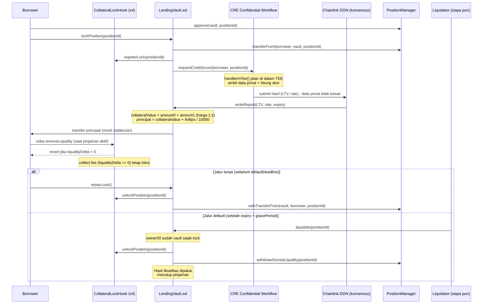

# Veilend
### Confidential Credit Scoring untuk Pinjaman Berbasis Posisi LP Uniswap v4

> Dokumen ini adalah rencana proyek untuk ETHGlobal ETHOnline 2026 (4–16 Sept 2026).
> Versi gabungan — Bagian 1–13 finalisasi 6–7 September 2026, Bagian 14–16 ditambahkan 7 September 2026 (arsitektur integrasi CRE, keputusan konfigurasi, alamat kontrak Sepolia terverifikasi).
> **Update 7 September 2026 (revisi timeline):** Bagian 7 dipadatkan dari 11 hari menjadi **6 hari** karena sisa waktu efektif yang tersedia lebih sempit dari perkiraan awal, dan development akan dibantu **AI coding agent** untuk mempercepat penulisan kode rutin. Referensi "11 hari" di bagian lain (Bagian 2, 4, 14.1) disesuaikan mengikuti perubahan ini.
> **Update 7 September 2026 (review arsitektur):** dua keputusan wajib sebelum coding dikunci — (11) collateral hanya dari pool demo ber-hook sendiri, (12) rumus valuasi agunan + nominal pinjaman. Lihat Bagian 12 #11–#12 dan Bagian 14.1.

---

## 1. Ringkasan Proyek

**One-liner:** Protokol lending di mana pemilik posisi LP Uniswap v4 bisa mendapat pinjaman dengan LTV (loan-to-value) lebih baik jika riwayat trading/risiko mereka — yang dihitung secara **rahasia** di dalam Chainlink CRE Confidential Workflow (TEE) — menunjukkan profil risiko rendah, tanpa pernah membocorkan data mentahnya ke publik.

---

## 2. Latar Belakang & Insight

**Masalah:** LP di Uniswap v4 sering punya modal "terkunci" di posisi likuiditas mereka. Kalau butuh dana cair, biasanya harus withdraw likuiditas (kehilangan fee/exposure) — padahal profil risiko LP tersebut (riwayat trading, seberapa sering rebalance, exposure ke volatilitas) sebenarnya bisa dipakai sebagai sinyal kelayakan kredit, mirip skor kredit di TradFi.

**Diferensiasi dari project sejenis yang sudah ada:**
| Project lain yang mirip (ditemukan saat riset) | Fokusnya | Bedanya dengan LP Credit Line |
|---|---|---|
| *LiquidMind* (CRE + Uniswap v4) | Automated rebalancing & dynamic fee | Kita bikin produk **kredit/lending**, bukan rebalancing otomatis |
| *Chainlink "Automated Portfolio Rebalancing" template* | Rebalancing alokasi portofolio | Sama-sama pakai pola confidential, tapi domain beda total |
| *Dark-pool trading RWA via CRE* (Convergence hackathon) | Eksekusi trade privat | Kita tidak menyembunyikan trade, tapi menyembunyikan **data & logika scoring kredit** |
| *InControl* (CRE + x402) | Monetisasi agent finansial personal | Tidak menyentuh Uniswap v4 LP position sama sekali |

Kesimpulannya: kombinasi "posisi LP v4 sebagai agunan" + "skor kredit privat via CRE" belum ditemukan di project manapun saat riset dilakukan.

---

## 3. Konsep Inti / How It Works

Alur singkat (versi MVP, disederhanakan dari full lending protocol):

1. Borrower punya posisi LP di **pool demo Veilend** — pool Uniswap v4 yang di-deploy proyek ini sendiri, dengan `CollateralLockHook` terpasang di `PoolKey` saat `initialize`. Posisi di pool Uniswap v4 existing (tanpa hook kita) **tidak diterima** sebagai agunan (lihat Bagian 12, Keputusan #11).
2. Sebelum lock, borrower `approve(vault, positionId)` di `PositionManager` — approval ini prasyarat wajib, dicek oleh `LendingVault` (lihat Bagian 12, Keputusan #6).
3. Borrower mengunci posisi tersebut sebagai agunan di kontrak `LendingVault` — **vault custody**: `lockPosition` memakai approval langkah 2 **sekarang** (`transferFrom` NFT ke vault). State loan tetap mencatat `borrower = msg.sender` (bukan `ownerOf` setelah transfer). Hook `registerLock` tetap dipanggil; enforcement decrease mengandalkan `CollateralLockHook` plus kepemilikan NFT di vault.
4. `LendingVault` memicu **CRE Workflow** (via event/HTTP trigger).
5. Di dalam CRE, ada **confidential handler** (`handlerInTee`) yang:
   - Mengambil data privat — pendekatan **hybrid**: 1 data point posisi LP asli (misal ukuran/umur posisi, diambil via view call ke `PositionManager`) digabung dengan riwayat risiko yang disimulasikan untuk keperluan demo.
   - Menghitung skor risiko → menentukan **LTV maksimum** dan **suku bunga**.
   - Logika scoring & data mentah **tidak pernah keluar dari enclave** — yang keluar cuma angka hasil akhir.
6. Hasil (LTV, rate, expiry) dikirim on-chain lewat laporan yang diverifikasi konsensus DON, ditulis ke `LendingVault`. `expiry` di sini juga jadi basis `defaultDeadline` (lihat langkah 9).
7. `LendingVault` menghitung `collateralValue` on-chain (harga mock 1:1) lalu mencairkan `principal = collateralValue × ltvBps / 10000` dalam mock stablecoin ke borrower (lihat Bagian 12, Keputusan #12).
8. Selama pinjaman aktif, **hook v4** (`CollateralLockHook`) mencegah borrower **mengurangi** likuiditas dari posisi yang terkunci (`liquidityDelta < 0` di-revert). Collect fee (`liquidityDelta == 0`) **tetap diizinkan** supaya agunan tetap produktif.
9. **Jalur lunas:** Saat pinjaman dilunasi (`repayLoan()`) sebelum `defaultDeadline` (`expiry + gracePeriod`) → vault menarik stable → hook membuka kunci → `safeTransferFrom` mengembalikan NFT ke `loan.borrower` → posisi bisa di-withdraw normal lagi.
10. **Jalur default:** Kalau borrower belum melunasi setelah lewat `defaultDeadline`, siapa pun (termasuk keeper/bot) bisa memanggil `liquidate(positionId)` di `LendingVault`. NFT **sudah** di vault sejak lock; `liquidate` mensyaratkan `ownerOf == vault` (tidak `transferFrom` dari borrower), unlock hook, lalu `withdrawSeizedLiquidity` mencairkan likuiditas untuk menutup pinjaman.



---

## 4. Arsitektur Teknis

| Komponen | Tanggung jawab | Teknologi |
|---|---|---|
| `CollateralLockHook.sol` | Hook v4 milik **pool demo Veilend**. Di `beforeRemoveLiquidity`, revert jika posisi terkunci **dan** `liquidityDelta < 0`. Collect fee (`liquidityDelta == 0`) lolos. Tetap menahan decrease selama lock, termasuk jika vault sendiri belum unlock | Solidity, Uniswap v4 hooks (`beforeRemoveLiquidity`) |
| `LendingVault.sol` | Custody NFT posisi saat `lockPosition`, cek approval + cek posisi berasal dari pool demo, terima laporan LTV dari CRE, hitung `principal` dari `collateralValue`, cairkan pinjaman, kembalikan NFT saat `repayLoan`, **eksekusi `liquidate()` (NFT sudah di vault) + `withdrawSeizedLiquidity()` saat default** | Solidity |
| Pool demo Veilend | Pool v4 yang di-`initialize` dengan `CollateralLockHook` sebagai hook di `PoolKey`; satu-satunya pool yang posisinya sah jadi agunan | Uniswap v4 `PoolManager.initialize` + 2 mock ERC-20 |
| `credit-scoring-workflow` | Workflow CRE dengan confidential handler untuk hitung skor & LTV | TypeScript (`@chainlink/cre-sdk`) |
| Mock token pair + mock stablecoin | Dua token pool (harga 1:1) dan token yang dipinjamkan ke borrower | ERC-20 sederhana (testnet) |
| Frontend/dashboard (opsional) | Demo visual: request loan → lihat LTV hasil → coba withdraw (kena revert) → repay | Next.js / script CLI (boleh sangat sederhana) |

**Catatan desain — hook menempel ke pool, bukan ke NFT (keputusan final, lihat Bagian 12 #11):** Hook Uniswap v4 adalah bagian dari `PoolKey` dan hanya dipanggil untuk pool yang diinisialisasi dengan hook itu. `CollateralLockHook` **tidak bisa** mengunci posisi di pool v4 existing (ETH/USDC resmi Sepolia, dsb.). Karena itu collateral MVP **hanya** posisi yang di-mint di pool demo Veilend. `ISubscriber` PositionManager **bukan** pengganti hook: subscriber adalah notifier, user bisa `unsubscribe`, dan `transferFrom` melepas subscriber. Limitasi “bukan sembarang LP v4” wajib ditulis di README, bukan disembunyikan.

**Catatan desain — vault custody saat lock (Keputusan #2, update 9 September 2026):** `lockPosition` memindahkan NFT PositionManager ke vault. `loan.borrower` tetap alamat pemanggil. Borrower bukan owner → tidak bisa `approve(0)` yang berarti, tidak bisa transfer NFT, tidak bisa `modifyLiquidities`. Hook tetap menahan decrease selama `locked == true` (termasuk jika vault sendiri belum unlock). Collect fee di level hook (`liquidityDelta == 0`) tetap diizinkan; vault **tidak** `collectFees` dan **tidak** meng-approve NFT kembali ke borrower selama pinjaman aktif.

**Catatan desain — mekanisme default / NFT sudah di vault (Keputusan #6, update 9 September 2026):** Approval di `lockPosition` adalah izin **pull sekarang**, bukan cadangan sampai default. Setelah `block.timestamp > expiry + gracePeriod` dan pinjaman belum lunas, `liquidate(positionId)` permissionless mensyaratkan `ownerOf == vault` (error `NftNotInVault` jika tidak), unlock hook, lalu `withdrawSeizedLiquidity()` mencairkan likuiditas. Tidak ada `transferFrom` dari borrower saat liquidate. `CollateralLockHook` tidak berubah — ia tetap hanya menjaga `removeLiquidity` selama `locked == true`.

**Detail confidential handler (bagian paling penting untuk prize Chainlink):**
- Wajib pakai `handlerInTee` (TypeScript) — bukan handler biasa.
- Minimal 1 dari: sensitive input, secret, confidential API response, private parameter, atau intermediate value harus diproses **di dalam** enclave.
- Sumber data (keputusan final, lihat Bagian 12): **hybrid** — fetch 1 data point posisi LP asli (via view call ke `PositionManager`, misal ukuran/umur posisi) sebagai *private input* di dalam TEE, digabung dengan riwayat risiko yang disimulasikan untuk hitung skor. Ini memenuhi syarat "sensitive input/private parameter diproses di dalam enclave" tanpa perlu integrasi API/indexer eksternal yang lebih berisiko molor.

---

## 5. Syarat Kualifikasi (Checklist per Partner)

### ✅ Uniswap Foundation — Best Uniswap Stack Contribution
- [ ] Repository GitHub publik, open-source
- [ ] File `FEEDBACK.md` di root repo
- [ ] Submit form Developer Feedback: https://developers.uniswap.org/hackathon-feedback (sertakan link `FEEDBACK.md`)
- [ ] README menunjuk jelas ke smart contract & baris kode yang relevan (khususnya `CollateralLockHook.sol`)

### ✅ Chainlink — Best Confidential Workflow
- [ ] CRE Workflow menggunakan Confidential Workflows untuk bagian **bermakna** dari aplikasi (bukan contoh terpisah/placeholder)
- [ ] Workflow mendaftarkan & pakai `handlerInTee` (TypeScript)
- [ ] Bagian confidential memproses minimal 1: sensitive input / secret / confidential API response / private parameter / intermediate value
- [ ] Bukti eksekusi: simulasi CRE CLI **atau** live deployment ke jaringan CRE
- [ ] Evidence disertakan di submission: demo video, terminal output, atau execution logs

---

## 6. Scope: MVP vs Stretch Goals

**MVP (harus selesai):**
- Deploy `CollateralLockHook` + **initialize pool demo Veilend** (2 mock ERC-20, hook terpasang di `PoolKey`) + mint ≥1 posisi tes di pool itu (keputusan #11)
- Hook v4 yang berhasil block decrease liquidity (`liquidityDelta < 0`) saat posisi terkunci, dan **tetap mengizinkan collect fee** di level hook (custody NFT di vault selama lock)
- CRE workflow dengan `handlerInTee` yang menghitung skor dari data hybrid (1 data point LP asli + simulasi risiko)
- Simulasi CRE CLI berhasil dijalankan & di-capture sebagai bukti (screenshot/log)
- `LendingVault` yang bisa lock (cek approval + pull NFT ke vault + cek pool demo) → dapat laporan LTV → hitung `principal` dari `collateralValue` (#12) → cairkan pinjaman → repay (kembalikan NFT) → unlock
- **Mekanisme default minimal (NFT sudah di vault)**: `liquidate(positionId)` mensyaratkan `ownerOf == vault` saat lewat `defaultDeadline`, lalu `withdrawSeizedLiquidity()` mencairkan collateral untuk menutup pinjaman — didemokan end-to-end (lihat Bagian 12, Keputusan #6)
- README + FEEDBACK.md + demo video — README wajib menyebut: (a) hanya pool demo ber-hook, (b) harga 1:1 / tanpa oracle, (c) relayer tepercaya, (d) NFT dikustodi vault selama lock (bukan “approval bisa dicabut setelah lock”)
- Hook tetap menahan decrease selama lock; collect fee di tengah pinjaman tidak diimplementasi di vault (`collectFees` di luar scope)

**Stretch goals (kalau waktu sisa):**
- Ikut Automated Liquidation Protection Challenge — **keputusan ikut/tidak baru diambil di hari buffer (hari 6), setelah MVP selesai** (lihat Bagian 12)
- Live deployment CRE workflow ke jaringan (bukan cuma simulasi)
- Frontend dashboard yang lebih polished
- Dynamic re-scoring (workflow jalan ulang berkala, bukan cuma sekali di awal pinjaman)
- Auto-liquidator/keeper bot, mekanisme lelang, atau partial liquidation (di MVP, seizure bersifat all-or-nothing dan dipanggil manual/permissionless tanpa keeper otomatis)
- `collectFees()` di vault selama pinjaman aktif

---

## 7. Rencana Waktu (± 6 Hari) — Direvisi 7 September 2026

> **Catatan revisi:** Timeline awal (11 hari) dipadatkan menjadi **6 hari** karena sisa waktu efektif yang tersedia lebih sempit dari perkiraan awal. Pemadatan ini dianggap realistis karena development dibantu **AI coding agent** untuk mempercepat penulisan boilerplate/kode rutin (skeleton kontrak, test case, dsb) — waktu manusia difokuskan ke keputusan desain, verifikasi integrasi, dan debugging bagian yang paling berisiko (hook, CRE handler, jalur default). Deadline resmi event tetap 16 September 2026, jadi hari 7–16 Sept otomatis jadi buffer tak terduga — tapi jangan mengandalkan buffer itu; anggap **hari 6 (12 Sept) sebagai target submit riil**.

| Hari | Tanggal | Fokus |
|---|---|---|
| 1 | 7 Sept | Setup repo (pakai `v4-template` resmi Uniswap + `HookMiner`, Bagian 14.1 #10); skeleton `CollateralLockHook.sol` (`beforeRemoveLiquidity`: revert jika locked && `liquidityDelta < 0`) & `LendingVault.sol` (state, `lockPosition()` dengan cek approval + cek pool demo); deploy hook; `initialize` pool demo Veilend (2 mock token, Keputusan #11); mint posisi LP tes di pool itu di Sepolia (alamat Bagian 15); prefund vault dengan mock stablecoin (Keputusan #12). AI coding agent dipakai untuk generate boilerplate hook & vault sekaligus. |
| 2 | 8 Sept | Bangun CRE workflow: implementasi `handlerInTee` sesuai algoritma Bagian 13.4 (ambil `liquidity` + `mintTimestamp` via `eth_getLogs`, hitung `creditScore`, mapping ke tier LTV/APR). Uji sampai simulasi CRE CLI berhasil & bisa di-capture sebagai bukti. *(Window `join()` Liquidation Protection Challenge juga mulai dibuka hari ini — belum wajib diputuskan sekarang, lihat checkpoint hari 6.)* |
| 3 | 9 Sept | Bangun relayer script (Bagian 14.2): subscribe event `PositionLocked` → trigger simulasi CRE CLI → parse hasil → panggil `submitCreditReport()` (`onlyRelayer`) di `LendingVault`. Uji end-to-end jalur lock → dapat report → pencairan pinjaman. |
| 4 | 10 Sept | Implementasi & uji jalur lunas (`repayLoan()` → unlock) dan jalur default (`defaultDeadline` terlewati → `liquidate()` → `withdrawSeizedLiquidity()`) end-to-end. Tulis unit & integration test (Foundry) — AI coding agent membantu generate test case dasar, waktu manusia fokus ke edge case. |
| 5 | 11 Sept | Tulis `README.md` (dengan link ke baris kode) & `FEEDBACK.md`, rekam demo video (≤5 menit) yang mencakup jalur lunas & jalur default, kumpulkan bukti simulasi CRE CLI (log/screenshot). |
| 6 (buffer & submit) | 12 Sept | Buffer bug fix & polish terakhir. Submit Uniswap Developer Feedback Form, submit ke ETHGlobal dashboard, pilih 2 partner prize (Uniswap + Chainlink). **Checkpoint:** kalau MVP sudah solid & masih ada waktu sebelum deadline event (16 Sept), baru pertimbangkan ikut stretch goal Liquidation Protection Challenge — kalau ragu, skip. |

---

## 8. Risiko & Mitigasi

| Risiko | Dampak | Mitigasi |
|---|---|---|
| Deploy v4-core sendiri di testnet lebih ribet dari perkiraan (hook address mining, dsb) | Delay di awal | Pakai starter template resmi Uniswap v4 hook (Foundry template) sejak hari 1, jangan build dari nol |
| Akses live Chainlink Confidential Compute terbatas/beta | Tidak bisa deploy live | Tidak masalah — simulasi CLI resmi diterima sebagai bukti kelulusan |
| Data "credit score" terlihat terlalu mengada-ada/mock | Juri ragu soal realism | Jelaskan eksplisit di README & demo bahwa data disimulasikan untuk keperluan demo, tapi arsitektur confidential-nya real dan bisa disambungkan ke data asli |
| Waktu habis sebelum sempat menulis FEEDBACK.md dengan baik | Kehilangan syarat wajib Uniswap | Alokasikan **Hari 5 (11 Sept)** khusus untuk dokumentasi, jangan ditunda ke hari terakhir |
| Salah kaprah “hook mengunci semua LP v4 existing” | Integrasi hari 1 gagal / juri Uniswap anggap tidak paham v4 | Collateral hanya dari pool demo ber-hook (Keputusan #11); jangan pakai `ISubscriber` sebagai ganti enforcement |
| Jalur lepas posisi di luar `modifyLiquidity` pada pool demo tidak terlihat hook | Residual risk meski NFT sudah di vault | NFT dikustodi vault saat lock (Keputusan #2); hook tetap menahan decrease. Jangan klaim hook menutup semua unwind path |
| LTV tanpa valuasi agunan → nominal pinjaman tidak terdefinisi | Vault tidak bisa mencairkan angka yang bisa dijelaskan ke juri | Pakai rumus Keputusan #12 (`collateralValue = amount0 + amount1` harga 1:1; `principal = collateralValue × ltvBps / 10000`); tanpa oracle di MVP |
| Borrower tidak melakukan `approve()` saat lock | `lockPosition` tidak bisa pull NFT | Approval dicek sebagai syarat wajib di `lockPosition()` (revert `ApprovalRequired`). Setelah pull, revoke/transfer dari borrower tidak memindahkan NFT dan tidak merusak `liquidate` |
| Kerja solo → tidak ada paralelisasi, satu blocker bisa menunda seluruh urutan berikutnya; timeline kini lebih padat (6 hari) sehingga marjin toleransi delay lebih kecil | Delay berantai di timeline | Ikuti urutan hari di Bagian 7 dengan ketat, pakai starter template resmi, dan manfaatkan AI coding agent untuk mempercepat penulisan kode rutin sehingga waktu manusia bisa fokus ke bagian paling berisiko (hook, CRE handler, jalur default) |

---

## 9. Tech Stack

- **Smart contracts:** Solidity, Foundry, Uniswap v4-core & v4-periphery
- **Chain:** Ethereum Sepolia testnet
- **Confidential workflow:** Chainlink CRE, `@chainlink/cre-sdk` (TypeScript), CRE CLI
- **Token:** 2 mock ERC-20 sebagai pair pool demo (harga 1:1) + 1 mock ERC-20 stablecoin untuk pinjaman
- **(Opsional) Frontend:** Next.js / ethers.js / viem — default MVP adalah script CLI / `cast`

---

## 10. Resource & Link Referensi

- Uniswap v4 deployments: https://docs.uniswap.org/contracts/v4/deployments — **alamat Sepolia sudah diverifikasi, lihat Bagian 15**
- Uniswap Developer Docs: https://developers.uniswap.org/docs
- Uniswap Hackathon Feedback Form: https://developers.uniswap.org/hackathon-feedback
- Chainlink CRE Docs: https://docs.chain.link/cre
- Hello Confidential Workflow (starter): https://docs.chain.link/cre-templates/hello-confidential-workflows
- Confidential Workflows Starter Templates (GitHub): https://github.com/smartcontractkit/cre-templates/tree/main/starter-templates/confidential-workflows
- Automated Liquidation Protection Template: https://docs.chain.link/cre-templates/automated-liquidation-protection
- Confidential Workflows Bootcamp (video): https://www.youtube.com/watch?v=ArHoB1JDSlE
- Liquidation Challenge repo (stretch goal): https://github.com/solangegueiros/cf-liquidation-protection-challenge

> ⚠️ Catatan penting dari Chainlink: pakai **CRE**, jangan Chainlink Functions atau Automation — keduanya sedang di-deprecate.

---

## 11. Deliverables Checklist Final (sebelum submit)

- [ ] Repo GitHub publik dengan history commit yang jelas (bukan 1 commit besar di akhir)
- [ ] `README.md` — deskripsi proyek, arsitektur, link ke baris kode kontrak & workflow CRE
- [ ] `FEEDBACK.md` — pengalaman pakai dokumentasi/tooling Uniswap
- [ ] Demo video ≤5 menit yang menunjukkan: request pinjaman → hasil LTV dari CRE → hook memblok withdrawal → repay → unlock
- [ ] Demo (bisa di video yang sama atau terpisah) yang menunjukkan jalur default: `defaultDeadline` terlewati → `liquidate()` berhasil menyita posisi → `withdrawSeizedLiquidity()` mencairkan collateral
- [ ] Bukti simulasi CRE CLI (log/screenshot/terminal output) disertakan di repo
- [ ] Submit Uniswap Developer Feedback Form
- [ ] Submit project ke ETHGlobal dashboard, pilih partner prize: **Uniswap Foundation** + **Chainlink**

---

## 12. Keputusan yang Sudah Diambil (finalisasi 6 September 2026, update mekanisme default 6 September 2026, update arsitektur hook & valuasi 7 September 2026)

Keputusan #1–#6 (produk) plus #11–#12 (arsitektur, dikunci 7 Sept). Keputusan konfigurasi #7–#10 ada di Bagian 14.1. Ringkasannya:

| # | Keputusan | Pilihan Final | Alasan Singkat | Status |
|---|---|---|---|---|
| 1 | Sumber data "credit score" | **Hybrid** — 1 data point posisi LP asli (via `PositionManager`) + sisanya riwayat risiko simulasi, diproses di dalam `handlerInTee` | Titik tengah: tetap ada elemen data nyata untuk kredibilitas, tanpa nambah kompleksitas integrasi API/indexer eksternal | ✅ Final, sudah disinkron ke Bagian 3 & 4 |
| 2 | Kepemilikan posisi LP saat dikunci | **Vault custody** (update 9 Sept 2026): `lockPosition` `transferFrom` NFT ke vault. `loan.borrower` tetap pemanggil. Hook tetap menahan decrease | Menutup celah revoke/transfer NFT setelah pinjaman cair; approval ERC-721 bukan lock | ✅ Final (direvisi 9 Sept 2026), sudah disinkron ke Bagian 3, 4 & 8 |
| 3 | Liquidation engine sungguhan | **Direvisi** — versi minimal (`liquidate` + `withdrawSeizedLiquidity`) dibangun di MVP; yang tetap jadi future work hanya auto-liquidator/keeper bot, lelang, dan partial liquidation | Skenario gagal bayar awalnya tidak tercakup di MVP; setelah dievaluasi ulang, mekanisme minimal tetap diperlukan agar protokol lending punya jalur penyelesaian gagal bayar yang lengkap, tanpa menambah scope besar (lihat Keputusan #6) | 🔄 Direvisi, sudah disinkron ke Bagian 3, 4, 6, 7, 8 & 11 |
| 4 | Ikut stretch goal Automated Liquidation Protection Challenge ($500) | **Ditunda** — evaluasi ulang di hari 6 (buffer), setelah MVP selesai | Ini scope tambahan dengan hard deadline join (mulai 8 Sept) dan tidak bisa diupdate setelah deadline submission; realistisnya baru bisa dinilai kalau MVP sudah aman. Timeline kini 6 hari (bukan 11), jadi marjin untuk stretch goal ini makin tipis — realistisnya kemungkinan besar akan di-skip | ⏳ Checkpoint di Bagian 7 (hari 6) |
| 5 | Ukuran tim & pembagian kerja | **Solo** — tidak ada pembagian kerja paralel | Timeline di Bagian 7 dijalankan sekuensial apa adanya, tanpa perlu breakdown per-orang | ✅ Final |
| 6 | Mekanisme default/gagal bayar borrower | **NFT sudah di vault** (update 9 Sept 2026): approval hanya prasyarat pull di `lockPosition`. `liquidate(positionId)` permissionless setelah `defaultDeadline` mensyaratkan `ownerOf == vault` (tidak `transferFrom` dari borrower), unlock hook, lalu `withdrawSeizedLiquidity()` | Celah `approve(0)` / `setApprovalForAll(false)` / transfer setelah lock membuat liquidate gagal pada model approval-cadangan. Custody di lock menutup itu tanpa wrapper NFT baru | ✅ Final (direvisi 9 Sept 2026), sudah disinkron ke Bagian 3, 4, 6, 7, 8 & 11 |
| 11 | Scope pool / di pool mana hook berlaku | **Hanya pool demo Veilend.** Deploy `CollateralLockHook`, lalu `initialize` pool sendiri dengan hook itu di `PoolKey`. `lockPosition()` revert jika posisi bukan milik pool demo. Posisi di pool v4 existing **ditolak**. Collect fee (`liquidityDelta == 0`) diizinkan; decrease (`liquidityDelta < 0`) di-revert selama lock | Hook v4 menempel ke pool saat initialize, bukan ke NFT/PositionManager global. Tanpa pool sendiri, `beforeRemoveLiquidity` tidak pernah dipanggil untuk posisi borrower. `ISubscriber` bukan enforcement | ✅ Final 7 Sept 2026, sudah disinkron ke Bagian 3, 4, 6, 7 & 8 |
| 12 | Valuasi agunan & nominal pinjaman | **Tanpa oracle.** Pair pool = 2 mock ERC-20 harga **1:1**. `collateralValue = amount0 + amount1`. `principal = collateralValue × ltvBps / 10000`. Vault di-prefund mock stablecoin saat deploy. CRE hanya mengembalikan syarat kredit `(ltvBps, aprBps, expiry)`; angka `principal` dihitung on-chain di vault | LTV tanpa nilai posisi tidak bisa mencairkan pinjaman. Price feed di luar scope 6 hari. Pemisahan ini juga jernih untuk juri: TEE memutuskan *berapa persen*, vault memutuskan *berapa banyak* | ✅ Final 7 Sept 2026, sudah disinkron ke Bagian 3, 4, 6, 7, 8 & 14 |

**Yang masih perlu dipantau saat development jalan:**
- Di hari 6/buffer (lihat Bagian 7), cek realistis-tidaknya ikut Liquidation Protection Challenge berdasarkan sisa waktu & kestabilan MVP. Kalau ikut, ingat window join dimulai 8 September dan **tidak boleh ada update workflow setelah deadline submission** — jadi kalau ragu, lebih aman untuk skip. Dengan timeline yang dipadatkan jadi 6 hari, asumsikan skip kecuali MVP selesai jauh lebih cepat dari perkiraan.
- Karena kerja solo, kalau ada satu bagian yang lebih ribet dari perkiraan (misal hook address mining di hari 1–2), pertimbangkan untuk memangkas scope frontend/dashboard (yang sudah ditandai opsional) daripada mengorbankan syarat wajib Uniswap/Chainlink.
- Nilai `gracePeriod` sudah dikunci di Bagian 14.1 #8 (`300` detik, khusus demo).
- Kalau menghitung `amount0`/`amount1` dari `liquidity` + tick + `sqrtPriceX96` (library Uniswap) memakan waktu di Hari 1–3, fallback yang sah: simpan `collateralValue` saat mint/lock sebagai `amount0 + amount1` yang diketahui dari transaksi mint posisi tes, atau proxy `collateralValue = liquidity` (1 unit liquidity = 1 unit mock-USD). Fallback wajib ditulis di README. Rumus `principal` tidak berubah.

---

## 13. Algoritma Credit Scoring: Perhitungan LTV & Suku Bunga (finalisasi 7 September 2026)

Detail perhitungan skor kredit yang dijalankan di dalam `handlerInTee`, mengisi bagian "menghitung skor risiko → menentukan LTV maksimum dan suku bunga" yang disebut di Bagian 3 langkah 5.

### 13.1 Tiga Keputusan Desain

| # | Keputusan | Pilihan Final | Alasan Singkat |
|---|---|---|---|
| 1 | Data LP asli untuk `positionScore` | **Gabungan ukuran (liquidity) + umur posisi** | Tidak menambah risiko integrasi (tetap via view call/RPC read ke `PositionManager`), tapi bikin skor lebih kredibel dibanding cuma 1 angka |
| 2 | Representasi riwayat risiko simulasi | **Riwayat pelunasan pinjaman** (`pastLoansCount` + `onTimeRepaymentRate`) | Paling langsung nyambung ke narasi "kredit", gampang dijelaskan ke juri tanpa perlu domain DeFi yang rumit |
| 3 | Cara mapping skor → LTV/rate | **Tiered / tingkatan** | Deterministik & gampang didemokan (skor tertentu = hasil pasti), lebih gampang dijustifikasi di README dibanding kurva linear |

### 13.2 Catatan Implementasi Penting — Sumber Data "Umur Posisi"

PositionManager v4 **tidak** menyimpan timestamp mint. Info posisi disimpan dalam struct packed `PositionInfo` yang isinya hanya poolId, tickUpper, tickLower, dan flag subscriber — tidak ada field waktu. Karena itu, `positionAgeDays` **tidak bisa** diambil lewat view call biasa.

**Pendekatan yang dipakai:** cari log event `Transfer` (ERC-721, `from = address(0)`) untuk `tokenId` posisi tersebut via `eth_getLogs`, lalu ambil block timestamp dari log itu sebagai waktu mint. Ini tetap operasi baca (read-only) yang dijalankan di dalam `handlerInTee`, jadi tetap konsisten dengan syarat "private input diproses di dalam enclave".

### 13.3 Konstanta

| Konstanta | Nilai | Keterangan |
|---|---|---|
| `CAP_LIQUIDITY` | disesuaikan skala mock token | liquidity ≥ nilai ini = skor size penuh (100) |
| `AGE_CAP_DAYS` | 90 | umur posisi ≥ 90 hari = skor age penuh (100) |
| `MIN_LOANS_FOR_FULL_TRUST` | 3 | histori <3 pinjaman → `riskHistoryScore` dibatasi maksimum 70 |
| `W_POSITION` | 0.4 | bobot `positionScore` dalam `creditScore` |
| `W_HISTORY` | 0.6 | bobot `riskHistoryScore` dalam `creditScore` |
| Tier 1 (score ≥ 80) | LTV 70%, APR 5% | risiko rendah |
| Tier 2 (score 60–79) | LTV 55%, APR 8% | risiko sedang-rendah |
| Tier 3 (score 40–59) | LTV 40%, APR 12% | risiko sedang-tinggi |
| Tier 4 (score < 40) | LTV 20%, APR 18% | lantai (floor) — tetap dapat pinjaman, bukan direject |

### 13.4 Formula (dihitung di dalam `handlerInTee`)

**Langkah 1 — Ambil data LP asli:**
`liquidity` diambil via view call/RPC read ke `PositionManager`. `mintTimestamp` diambil via `eth_getLogs` (lihat 13.2), lalu:

> `positionAgeDays = (waktu sekarang − mintTimestamp) / 86400`

**Langkah 2 — Normalisasi jadi `positionScore`:**

> `sizeScore = min(liquidity / CAP_LIQUIDITY, 1) × 100`
> `ageScore = min(positionAgeDays / AGE_CAP_DAYS, 1) × 100`
> `positionScore = 0,5 × sizeScore + 0,5 × ageScore`

**Langkah 3 — Skor riwayat risiko dari data simulasi (`riskHistoryScore`):**

> `riskHistoryScore = onTimeRepaymentRate × 100`
> Jika `pastLoansCount < MIN_LOANS_FOR_FULL_TRUST` (3), maka `riskHistoryScore` dibatasi maksimum **70**.

Profil simulasi untuk demo (lookup table per wallet, bukan random — supaya hasil demo terkontrol & reproducible; siapkan minimal 3 test wallet berbeda untuk ditunjukkan berdampingan di video demo):

| Wallet (contoh) | `pastLoansCount` | `onTimeRepaymentRate` | Profil |
|---|---|---|---|
| Test Wallet A | 8 | 0,98 | Excellent |
| Test Wallet B | 4 | 0,85 | Average |
| Test Wallet C | 5 | 0,60 | Risky |
| *(tidak terdaftar)* | 0 | 0,75 | Default netral |

**Langkah 4 — Gabungkan jadi `creditScore`:**

> `creditScore = W_POSITION × positionScore + W_HISTORY × riskHistoryScore`
> `creditScore = 0,4 × positionScore + 0,6 × riskHistoryScore`

**Langkah 5 — Mapping ke LTV & APR:** gunakan tabel tier di 13.3 berdasarkan nilai `creditScore`.

**Langkah 6 — Expiry:** `expiry = waktu sekarang + 3600 detik` (quote berlaku 1 jam).

**Yang keluar dari enclave:** hanya `(ltvBps, aprBps, expiry)`. Nilai `creditScore`, `positionScore`, `riskHistoryScore`, `liquidity`, dan `mintTimestamp` tidak pernah meninggalkan `handlerInTee`.

**Yang tidak dihitung di CRE:** nominal pinjaman. `principal` dihitung on-chain di `LendingVault` setelah report diterima, memakai `collateralValue` (Keputusan #12). TEE memutuskan *syarat kredit*; vault memutuskan *berapa yang dicairkan*.

### 13.5 Edge Cases

| Kasus | Penanganan |
|---|---|
| Wallet borrower tidak ada di lookup table demo | Default netral (`onTimeRepaymentRate = 0.75`), tetap kena cap `MIN_LOANS_FOR_FULL_TRUST` (skor maks 70) |
| Posisi baru (`positionAgeDays` ≈ 0) | `ageScore` rendah, tapi tetap masuk Tier 4 (bukan reject total) — hard-reject di bawah skor tertentu adalah penambahan opsional di `scoreToTerms`, belum bagian dari MVP |
| `liquidity = 0` | Seharusnya tidak terjadi karena `lockPosition()` di `LendingVault` mensyaratkan posisi punya liquidity > 0, tapi tetap perlu guard di kode |

### 13.6 Catatan Representasi Angka On-Chain

Karena hasil `(ltv, apr)` akan ditulis on-chain lewat laporan yang diverifikasi DON, representasikan sebagai **integer basis points** (misal `7000` = 70%, bukan float `0.70`) — Solidity tidak punya tipe native untuk pecahan.

---

## 14. Arsitektur Integrasi CRE ↔ LendingVault & Keputusan Konfigurasi

### 14.1 Ringkasan Keputusan

| # | Keputusan | Pilihan Final | Alasan Singkat |
|---|---|---|---|
| 7 | Mekanisme trigger CRE ↔ LendingVault | **Relayer script + HTTP trigger** | Paling mudah dikontrol solo dev dalam 6 hari (dibantu AI coding agent), tidak bergantung akses live CRE network, cukup untuk syarat "simulasi CLI" prize Chainlink |
| 8 | Nilai `gracePeriod` | **5 menit (300 detik)**, khusus testnet/demo | Supaya jalur default bisa ditunjukkan langsung di video tanpa menunggu lama |
| 9 | Formula bunga saat `repayLoan()` | **Flat**: `repayAmount = principal + (principal × aprBps / 10000)`, tidak diprorata waktu | `expiry` cuma ~1 jam (Bagian 13.4 Langkah 6), jadi prorata harian/tahunan akan menghasilkan bunga mendekati nol — flat lebih jelas untuk demo |
| 10 | Pendekatan hook address mining | **`v4-template` resmi Uniswap + `HookMiner`** (bukan mining manual) | Bukan trade-off strategis, murni best practice eksekusi — mengurangi risiko bug CREATE2 di hari 1-2 |
| 11 | Scope pool / hook | **Pool demo Veilend saja** — lihat Bagian 12 #11 | Hook v4 per-pool; tidak ada cara jujur mengunci LP di pool existing |
| 12 | Valuasi & `principal` | **`collateralValue = amount0 + amount1` (1:1); `principal = collateralValue × ltvBps / 10000`; vault prefund** — lihat Bagian 12 #12 dan 14.6 | LTV tanpa nilai agunan tidak operasional; oracle di luar MVP |

### 14.2 Alur End-to-End dengan Relayer Script

1. Borrower mint posisi di **pool demo Veilend**, `approve()` `PositionManager` → panggil `lockPosition(positionId)` di `LendingVault` (revert jika pool ≠ pool demo).
2. `LendingVault` emit event `PositionLocked(address borrower, uint256 positionId, uint256 timestamp)`.
3. **Relayer script** (Node.js/TypeScript, pakai `ethers.js` atau `viem`) berjalan sebagai proses terpisah, subscribe ke event ini lewat WebSocket provider (atau polling `eth_getLogs` tiap beberapa detik kalau RPC tidak mendukung WS).
4. Begitu event tertangkap, relayer memicu CRE workflow. Dua opsi teknis yang setara — pilih salah satu saat implementasi:
   - **(a)** Jalankan `cre workflow simulate --input {...}` sebagai child process dari relayer, parse output JSON dari stdout, **atau**
   - **(b)** Kalau workflow di-deploy sebagai HTTP-triggered, relayer `fetch()` ke endpoint tersebut dengan payload `{ borrower, positionId }`.
5. Di dalam CRE, `handlerInTee` menjalankan logika Bagian 13.4 (ambil `liquidity` + `mintTimestamp`, hitung `creditScore`, mapping ke tier) dan mengembalikan `(ltv, aprBps, expiry)`.
6. Relayer menerima hasil, lalu memanggil `submitCreditReport(borrower, positionId, ltv, aprBps, expiry)` di `LendingVault`.
7. `submitCreditReport()` dibatasi modifier `onlyRelayer` (satu address relayer yang dikonfigurasi saat deploy) — **bukan** verifikasi konsensus DON penuh. Ini simplifikasi yang wajib disebutkan eksplisit di README (lihat 14.3).
8. `LendingVault` menghitung `collateralValue` (Bagian 14.6), mencairkan `principal = collateralValue × ltvBps / 10000` mock stablecoin ke borrower, dan set `defaultDeadline = expiry + GRACE_PERIOD`.

### 14.3 Catatan Wajib untuk README

> Pola integrasi CRE↔Vault di proyek ini menggunakan **relayer script tepercaya** sebagai jembatan antara event on-chain, eksekusi CRE workflow (via simulasi CLI), dan penulisan hasil kembali ke `LendingVault`. Ini adalah simplifikasi yang disengaja untuk scope hackathon 6 hari — versi produksi akan menggunakan mekanisme pengiriman report CRE asli dengan verifikasi konsensus DON on-chain (signature verification), bukan `onlyRelayer` tunggal.

Menyebutkan ini eksplisit penting supaya juri Chainlink melihat tim paham trade-off arsitekturnya, bukan sekadar tidak tahu bedanya.

### 14.4 Update Tabel Konstanta (melengkapi Bagian 13.3)

| Konstanta | Nilai | Keterangan |
|---|---|---|
| `GRACE_PERIOD` | `300` detik | Khusus testnet/demo — dokumentasikan di README bahwa nilai produksi realistis akan jauh lebih panjang (hitungan hari) |
| Harga token pool demo | `1:1` | `amount0` dan `amount1` dijumlah langsung; tanpa oracle |
| Formula `principal` | `collateralValue × ltvBps / 10000` | Dihitung on-chain di `submitCreditReport` |
| Formula repay | `repayAmount = principal + (principal × aprBps / 10000)` | Flat, tidak diprorata terhadap durasi aktual pinjaman berjalan |

### 14.5 Tambahan Interface untuk Skeleton `LendingVault.sol`

Fungsi/state baru yang perlu ditambahkan ke skeleton kontrak sesuai keputusan di atas (kerangka konsep, bukan kode final):

```solidity
address public relayer; // dikonfigurasi saat deploy — address yang menjalankan relayer script

modifier onlyRelayer() {
    require(msg.sender == relayer, "not authorized relayer");
    _;
}

event PositionLocked(address indexed borrower, uint256 indexed positionId, uint256 timestamp);

function submitCreditReport(
    address borrower,
    uint256 positionId,
    uint256 ltvBps,
    uint256 aprBps,
    uint256 expiry
) external onlyRelayer {
    // simpan LTV/APR/expiry
    // collateralValue = _valueOf(positionId)   // amount0 + amount1, harga 1:1
    // principal = collateralValue * ltvBps / 10000
    // defaultDeadline = expiry + GRACE_PERIOD
    // transfer mock stablecoin ke borrower
}

function _valueOf(uint256 positionId) internal view returns (uint256 collateralValue) {
    // baca amount0 + amount1 posisi di pool demo (lihat 14.6)
}
```

### 14.6 Valuasi Agunan & Nominal Pinjaman (Keputusan #12)

CRE **tidak** mengembalikan besar pinjaman. Yang keluar dari enclave tetap hanya syarat kredit: `(ltvBps, aprBps, expiry)`.

**Asumsi demo (wajib sama di README dan video):**

1. Pool demo memakai dua mock ERC-20 (`MockA`, `MockB`) dengan harga **1:1** terhadap mock stablecoin.
2. `collateralValue = amount0 + amount1` (satuan token = satuan mock-USD).
3. `principal = collateralValue × ltvBps / 10000`.
4. Saat deploy, mint mock stablecoin dalam jumlah besar ke `LendingVault` (prefund). Tanpa ini `transfer` pinjaman revert.
5. Tidak ada Chainlink Price Feed / oracle lain di MVP.

**Cara dapat `amount0` / `amount1` (urutan preferensi):**

| Prioritas | Cara | Kapan dipakai |
|---|---|---|
| 1 | Hitung dari state posisi: `liquidity` + `tickLower` / `tickUpper` + `sqrtPriceX96` pool, memakai library Uniswap (`LiquidityAmounts` / `StateView`) | Default, kalau sempat di Hari 1–3 |
| 2 | Snapshot `amount0 + amount1` dari transaksi mint posisi tes, simpan di vault saat `lockPosition` | Fallback sah |
| 3 | Proxy `collateralValue = liquidity` (1 unit liquidity = 1 mock-USD) | Fallback terakhir; wajib disebut di README |

Produksi nanti mengganti langkah 1–3 dengan valuasi LP + oracle harga. Itu future work, bukan MVP.

---

## 15. Alamat Kontrak Uniswap v4 — Ethereum Sepolia (Terverifikasi 7 September 2026)

Melengkapi TODO di Bagian 10 ("cek alamat testnet terbaru").

| Contract | Address |
|---|---|
| PoolManager | `0xE03A1074c86CFeDd5C142C4F04F1a1536e203543` |
| PositionManager | `0x429ba70129df741B2Ca2a85BC3A2a3328e5c09b4` |
| StateView | `0xe1dd9c3fa50edb962e442f60dfbc432e24537e4c` |
| Universal Router | `0x3A9D48AB9751398BbFa63ad67599Bb04e4BdF98b` |
| Universal Router 2.1.1 | `0x7dfd4f31be6814d2906bde155c3e1b146eac1468` |
| ReservesLens | `0x0000001b173C3bbF3984D417d8614E3eed34865B` |
| Quoter | `0x61b3f2011a92d183c7dbadbda940a7555ccf9227` |
| PoolSwapTest | `0x9b6b46e2c869aa39918db7f52f5557fe577b6eee` |
| PoolModifyLiquidityTest | `0x0c478023803a644c94c4ce1c1e7b9a087e411b0a` |
| Permit2 | `0x000000000022D473030F116dDEE9F6B43aC78BA3` |

> Sumber: dashboard resmi Uniswap Developer (docs.uniswap.org/contracts/v4/deployments), Sepolia — chain ID `11155111`.

**Yang dipakai langsung di proyek ini:**
- `PoolManager` — konstruktor `CollateralLockHook` (`IPoolManager`) **dan** `initialize` pool demo Veilend (Keputusan #11).
- `PositionManager` — borrower `approve()` + mint posisi tes di pool demo; `handlerInTee` baca `liquidity` (Bagian 13.4 Langkah 1).
- `StateView` — baca `sqrtPriceX96` / liquidity untuk `_valueOf()` (Bagian 14.6) dan/atau data di `handlerInTee`.
- `Permit2` — perlu dicek saat implementasi: dipakai untuk flow approve stablecoin pinjaman/repay, atau cukup `approve()` ERC-20 biasa. Ini detail implementasi kecil, bukan keputusan arsitektur.

Pool demo Veilend **bukan** pool resmi di tabel atas — alamatnya baru ada setelah `initialize` di Hari 1 dan harus dicatat di README.

---

## 16. Status Keputusan Terbuka: Tuntas

| Item | Status |
|---|---|
| Sumber data credit score (Bagian 12 #1) | ✅ |
| Kepemilikan posisi LP saat lock (Bagian 12 #2) | ✅ |
| Liquidation engine (Bagian 12 #3) | ✅ |
| Stretch goal liquidation challenge — checkpoint hari 6 (Bagian 12 #4) | ⏳ (memang sengaja ditunda ke hari 6, kemungkinan besar di-skip) |
| Ukuran tim (Bagian 12 #5) | ✅ |
| Mekanisme default (Bagian 12 #6) | ✅ |
| Algoritma scoring lengkap (Bagian 13) | ✅ |
| Arsitektur trigger CRE↔Vault (Bagian 14.1 #7) | ✅ |
| Nilai `gracePeriod` (Bagian 14.1 #8) | ✅ |
| Formula bunga repay (Bagian 14.1 #9) | ✅ |
| Hook address mining approach (Bagian 14.1 #10) | ✅ |
| Scope pool demo ber-hook sendiri (Bagian 12 #11) | ✅ |
| Valuasi agunan & rumus `principal` (Bagian 12 #12 / 14.6) | ✅ |
| Alamat kontrak Sepolia (Bagian 15) | ✅ |

Siap masuk fase development sesuai timeline Bagian 7 yang sudah dipadatkan (Hari 1, 7 September: setup repo, skeleton `CollateralLockHook.sol` & `LendingVault.sol`, deploy hook + initialize pool demo Veilend, mint posisi tes di pool itu, prefund vault — memakai alamat Uniswap di Bagian 15).
